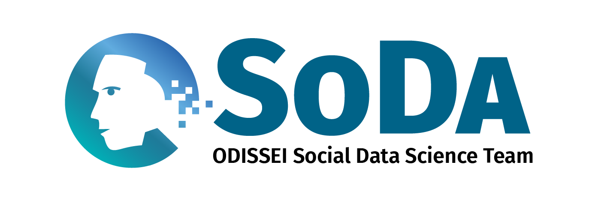

# SICSS Workshop Data Collection/Annotation & Inferences with LLMs in Social Sciences

This repository contains the code and slides for the SICSS workshop on data collection/annotation and inference with Large Language Models. In particular, we cover:

1. How LLMs work and how to use them in computational social science research workflows.
2. How to use LLMs for data collection and annotation via API calls to various cloud providers, including best practices and potential pitfalls.
3. How to run LLM inference on sensitive data in [SANE](https://odissei-data.nl/facility/secure-analysis-environment-sane/), a secure analysis environment.
4. How to use LLM annotations in downstream inferential regression analyses.

A more general version of this repository, which is not specific to the SICSS curriculum and computing infrastructure (e.g., `Python 3.8.18`, `R 4.5.3`, `SANE`), is available [here](https://github.com/sodascience/workshop_llm_data_collection).

The materials on this page are [CC-BY-4.0](https://creativecommons.org/licenses/by/4.0/) licensed.


## Full Workshop Schedule

| Time  | Title                                | Notebooks                                                                            | Recommended Environment |
| :---- | :----------------------------------- | :------------------------------------------------------------------------------------------- | :---------------------- |
| 09:30 | LLM fundamentals for Social Sciences |                                                  | |
| 11:00 | Coffee break                         |                                                  | |
| 11:20 | Data collection/annotation with LLMs | [`python`](./notebooks/1sicss_llm_data_collection_py.ipynb), [`R`](./notebooks/1sicss_llm_data_collection_R.ipynb)| Google Colab |
| 12:30 | Lunch break                          |                                                                       | |
| 13:30 | Secure LLM inference in SANE          | [`python`](./notebooks/2sane_llm_data_collection_py.ipynb), [`R`](./notebooks/2sane_llm_data_collection_R.qmd)   | SANE only |
| 15:00 | Inference with LLM annotations       | [`python`](./notebooks/3sicss_llm_inferential_regression_py.ipynb), [`R`](./notebooks/3sicss_llm_inferential_regression_R.qmd)     | Local machines or SANE |
| 16:30 | Conclusion & Q&A                     |                                                                                              | |


## Technical details
- No previous experience with LLMs is required.
- `R` or `python` programming knowledge is desired but not required.
- In python we will use [`langchain`](https://python.langchain.com/docs/introduction/), in R we will use [`ellmer`](https://ellmer.tidyverse.org/) to streamline interaction with LLM APIs.

## Preparation
### Get Your Own API Keys
You will need an API key for the respective LLM provider you plan to use. An API key is a unique identifier that allows you to authenticate and interact with the provider's services.

If you are attending the workshop *in person*, detailed instructions for obtaining API keys will be provided by the instructor separately. Otherwise, you can follow the instructions below to obtain API keys for the providers we will use in the workshop:

- **Hugging Face Inference API:**
	1. Create an account at https://huggingface.co/.
	2. Go to https://huggingface.co/settings/tokens and create a new access token.

- **OpenAI:**
	1. Create an account at https://platform.openai.com/.
	2. Create an API key at https://platform.openai.com/api-keys.

- **Groq:**
	1. Create an account at https://console.groq.com/.
	2. Create an API key in the Groq console.

- **SURF AI Hub**:
	1. It is in pilot phase and requires an [application](https://servicedesk.surf.nl/wiki/spaces/WIKI/pages/222464732/Onboarding#Onboarding-Step1%3AShowinterest) and approval process to get access.
	2. Once you have access, you can create an API key at https://willma.surf.nl/.

Save your API keys in a safe place. The notebooks will prompt you to enter the keys at runtime.

### Set Up SANE and Replicate SANE Environments Locally
See [here](https://github.com/AngelicaMaineri/odissei-sicss26-setup) for detailed instructions on how to set up your R environment in SANE and reproduce on your own local machine the exact Python and R environments installed in SANE. 

## Additional Resources
### Tutorial Paper
Read and cite our tutorial paper (preprint):
- Fang, Q., Bernardo, J. G., & van Kesteren, E. J. (2026). A Methodological Guide on Using Large Language Models for Text Annotation in the Social Sciences and Humanities with Python and R. arXiv preprint arXiv:2604.09638.
- [`Download`](https://arxiv.org/abs/2604.09638) from arXiv

### Guide to LLM Computing Infrastructure in the Netherlands
- [Link](https://sodascience.github.io/soda_llm_infra_guide/)

## [Optional] Run Locally
Note, if you already have Python, R and Ollama set up on your local machine according to the [instructions](https://github.com/AngelicaMaineri/odissei-sicss26-setup) in the previous section, you do not need to follow the instructions in this section. You can simply download and open the notebooks in your local Python/R environment and run them directly. The instructions below are for those who want to set up a Python/R environment that satisfies the minimum requirements to run notebooks in this repository.

### With uv and Python

If you plan to run the Python notebooks locally, we recommend using [`uv`](https://github.com/astral-sh/uv) to set up a clean Python environment. You can also use `uv` to launch Jupyter Lab or Notebook.

1. Clone the repository:
	- `git clone https://github.com/sodascience/sicss_llm_workshop.git`
	- `cd sicss_llm_workshop`
2. Create and sync the environment:
	- `uv venv`
	- `uv sync`
3. Start Jupyter [Optional]:
	- `uv run jupyter lab`  (or `uv run jupyter notebook`)

If you use a different environment manager, make sure the dependencies in `pyproject.toml` are installed before running the notebooks.

## With renv and R

If you plan to run the R notebooks locally, we recommend using [`renv`](https://rstudio.github.io/renv/) to restore the exact package environment used in this workshop.

1. Clone the repository:
	- `git clone https://github.com/sodascience/sicss_llm_workshop.git`
	- `cd sicss_llm_workshop`
2. Open the project in RStudio (or start R in the repository root), then restore the environment:
	```r
	install.packages("renv")  # skip if renv is already installed
	renv::restore()
	```
3. Open the R notebooks (`.qmd` for RStudio or `.ipynb` for Visual Studio Code) and run them as usual.

`renv::restore()` reads `renv.lock` and installs the exact package versions recorded there into a project-local library, so your system R installation is not affected.

## Contact

This project is developed and maintained by the [ODISSEI Social Data Science (SoDa)](https://odissei-soda.nl/) team.



Do you have questions, suggestions, or remarks? File an [issue](https://github.com/sodascience/sicss_llm_workshop/issues) or feel free to contact [Qixiang Fang](https://github.com/fqixiang).